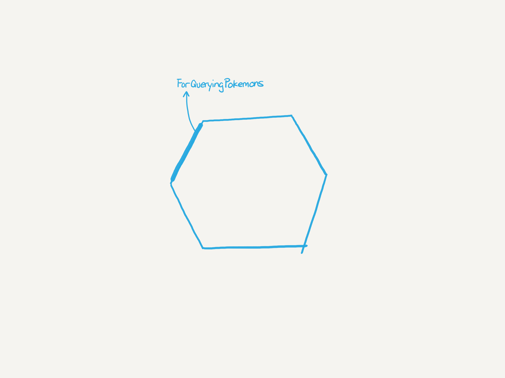
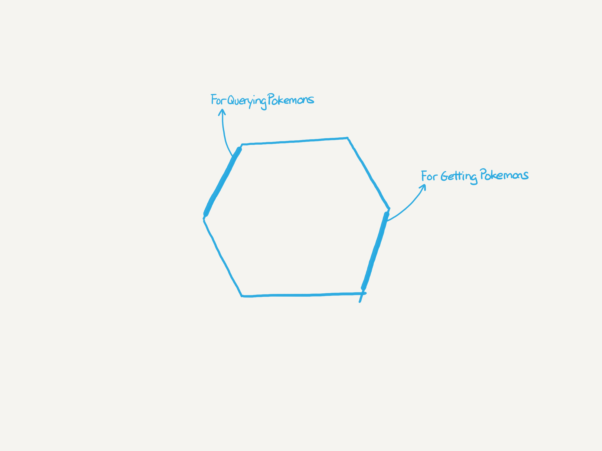
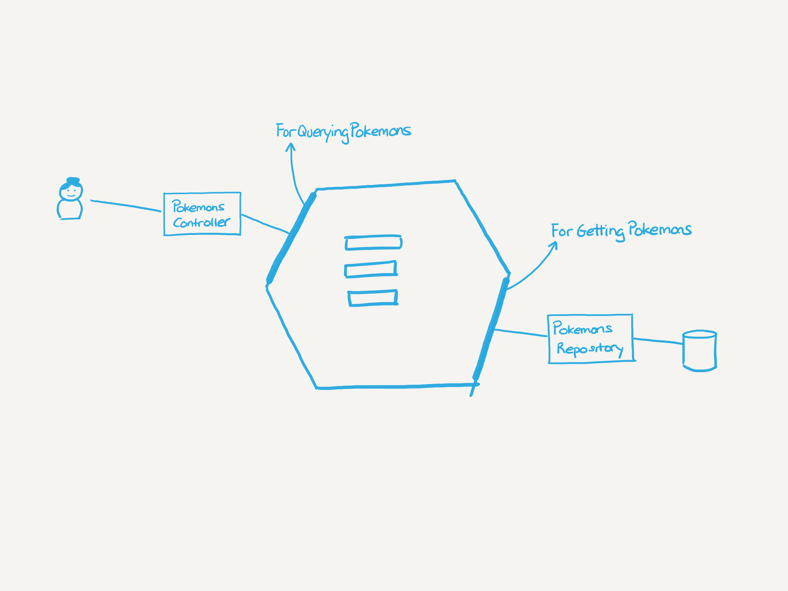

# Development notes

The idea is to implement the [IBM Quantum backend code challenge](https://github.com/IBMQuantum/backend-code-challenge).

Doing this coding practice the goals are:
* Using Hexagonal Architecture new insights.
* Using TDD or ATDD.
* Decomposing "stories" into thin vertical slices.

## Requirements

The instructions don't define user stories, so we will just write down the requirements given.

* Query Pokemons by type.
* Query favorite Pokemons.
* Query Pokemons paginated.
* Get a Pokemon by its ID.
* Get a Pokemon by its name.
* Get the types of Pokemons as a list.
* Mark (or unmark) a Pokemon as favorite.

## Step by step development

My first step will be to check the requirements, removing duplicated functionality and organizing (sorting) them to make the development process simpler.

* Get a Pokemon by its ID.
* Get a Pokemon by its name.
* Query Pokemons paginated.
* Query Pokemons by type.
* Mark (or unmark) a Pokemon as favorite.
* Query favorite Pokemons.
* Get the types of Pokemons as a list.

### Get a Pokemon by its ID

Probably the easiest one to start with, and define the first port of the Hexagonal Architecture.

The first step is to create a test that forces the creation of the port interface and a basic implementation of the Pokemon Catalog, returning hardcoded values.

From the hexagon API some decisions where applied related to the data structure:
1. Because the ID of a Pokemon is a string, at the `evolution` field `id` is transformed into string.
2. The height and weight of a Pokemon is returned with the unit separated from the value, so it can change in the future.

Once we have the driver port, we will create a driven port that will match with the repository, using a second test.

Once we have the second port, we already defined the hexagon, and we can delete the previous test because it makes no sense anymore and it is not giving any advantage.

At this point we solved all the required scaffolding, and we created the ports interfaces. Now we need to create the REST endpoint and test with an e2e test that all is working properly using actual adapters.

